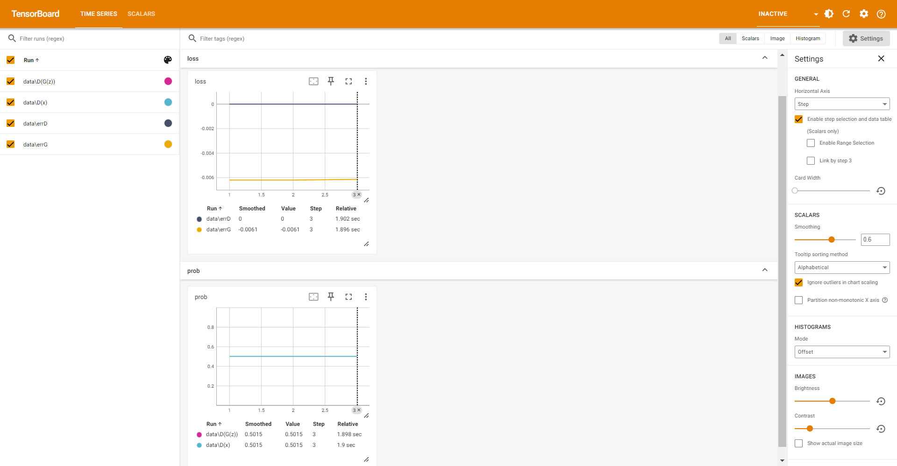

# repro-gan

repro-gan is an open-source 1D PyTorch GAN library that provides you with modules, utilities, and metrics to create GAN models easily. The main goal of this library is to improve the reproducibility of 1D GANs and make it easier for researchers and developers to experiment with GAN models. 

## Features
- Customizable modules for building discriminator and generator neural networks
- Utility functions such as tensorboard visualization, loggers, and trainer
- FID score calculation for evaluating the performance of GAN models
- Out-of-the-box GAN and WGAN-GP models for reproducible GANs
- Composable loss functions in variety

## Usage
Example usage for building a simple WGAN-GP model

```
class Discriminator(WGANGPBaseDiscriminator):
    def __init__(self, **kwargs):
        super().__init__(channels=64)
        self.block1 = DBlock(in_channels=64, out_channels=64, kernel_size=3, stride=1, padding=1, downsample=True)
        self.block2 = DBlock(in_channels=64, out_channels=64, kernel_size=3, stride=1, padding=1, downsample=True)
        self.block3 = DBlock(in_channels=64, out_channels=64, kernel_size=3, stride=1, padding=1, downsample=True)
        self.conv = nn.Conv1d(in_channels=64, out_channels=64, kernel_size=1, stride=1, padding=0)
        self.end = nn.Linear(394, 1)
        nn.init.normal_(self.conv.weight.data, 0.0, 0.02)
        nn.init.normal_(self.end.weight.data, 0.0, 0.02)

    def forward(self, x):
        x = x.float()
        h = self.block1(x)
        h = self.block2(h)
        h = self.block3(h)
        h = self.conv(h)
        h = self.end(h)
        return h.view(h.shape[0], 64)

class Generator(WGANGPBaseGenerator):
    def __init__(self, **kwargs):
        super().__init__(channels=64, nz=3152) # noise shape will start off as real_data.shape[0] x channels x nz
        self.block1 = GBlock(in_channels=64, out_channels=64, kernel_size=3, stride=1, padding=1, upsample=False)
        self.block2 = GBlock(in_channels=64, out_channels=64, kernel_size=3, stride=1, padding=1, upsample=False)
        self.block3 = GBlock(in_channels=64, out_channels=64, kernel_size=3, stride=1, padding=1, upsample=False)
        self.conv = nn.Conv1d(in_channels=64, out_channels=64, kernel_size=1, stride=1, padding=0)
        nn.init.normal_(self.conv.weight.data, 0.0, 0.02)

    def forward(self, x):
        x = x.float()
        h = self.block1(x)
        h = self.block2(h)
        h = self.block3(h)
        h = self.conv(h)
        return h
    
device = torch.device('cuda' if torch.cuda.is_available() else "cpu")
data = torch.tensor(np.load("./examples/test_data.npy")).detach() # torch.Size([2, 64, 3152])
dataloader = DataLoader(
    TensorDataset(data),
    batch_size=1,
    shuffle=True
)
netD = Discriminator().to(device)
netG = Generator().to(device)
optD = optim.Adam(netD.parameters(), 0.0001, (0.5, 0.99))
optG = optim.Adam(netG.parameters(), 0.0001, (0.5, 0.99))

trainer = Trainer(
    netD=netD, # netD=netD.module to use GPU
    netG=netG, # netD=netD        to use CPU
    optD=optD,
    optG=optG,
    n_dis=1,
    num_steps=3,
    dataloader=dataloader,
    save_steps=1,
    print_steps=1,
    log_steps=1,
    log_dir='./examples/logs',
    device=device)
trainer.train()
```

## Tensorboard
Open terminal and use `logdir` to point to your model's checkpoints

```
tensorboard --logdir ./logs
```

<p align="center">
  
</p>