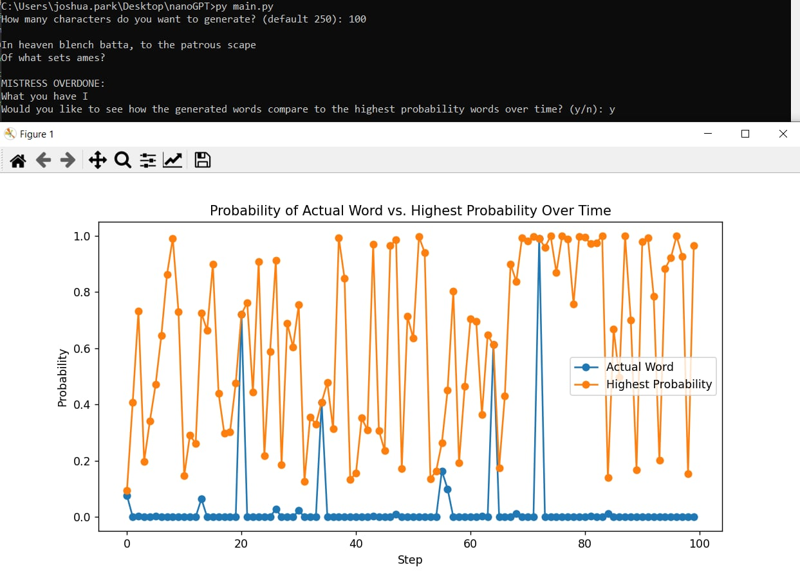
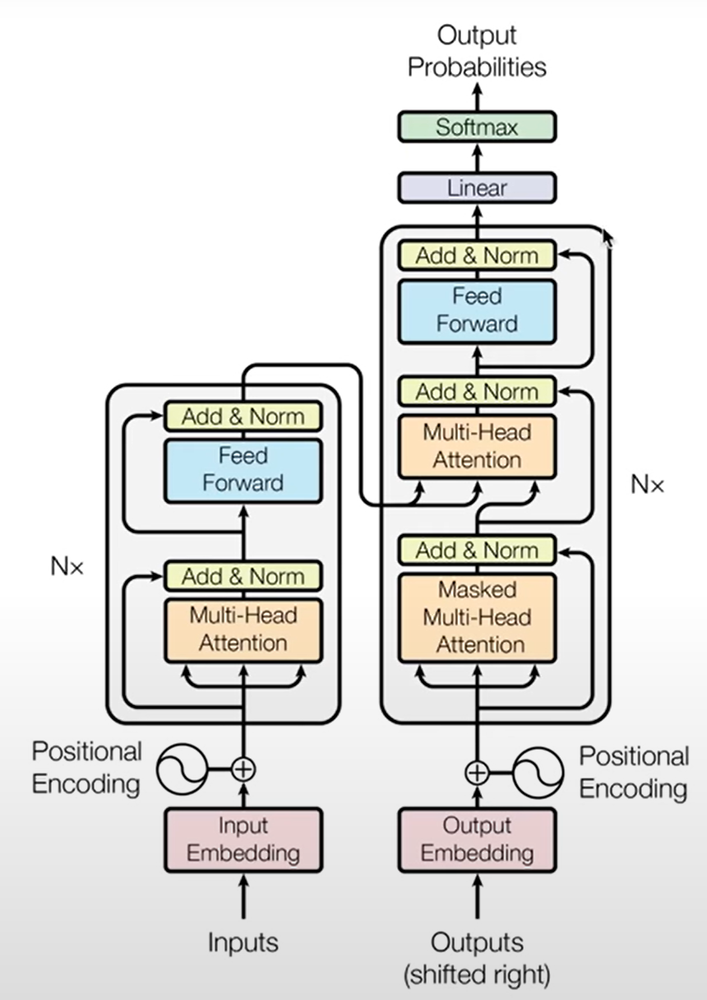
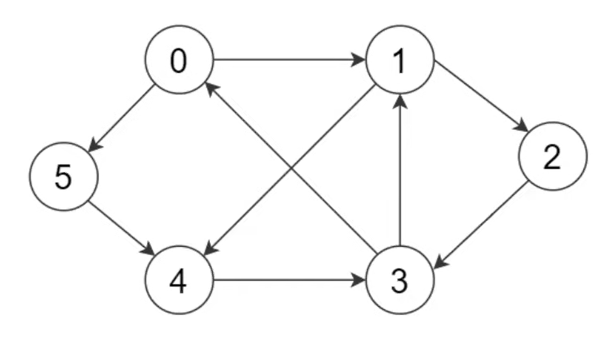
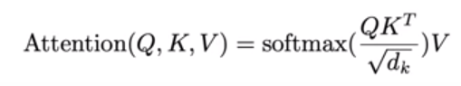
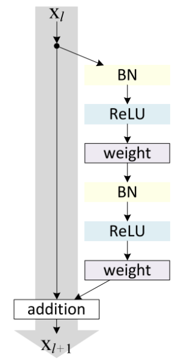
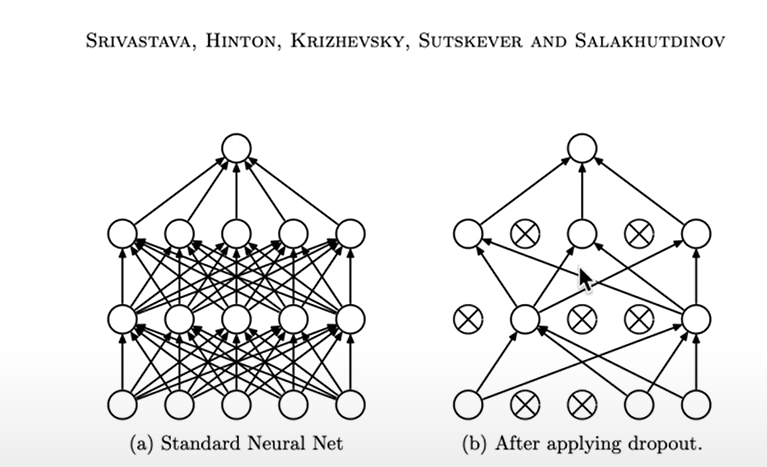
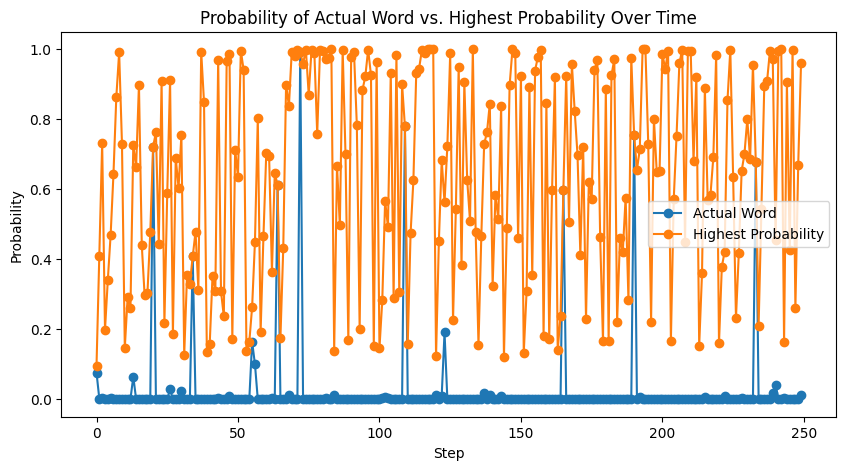

# NanoGPT with Next Word Distribution Visualized

Large Language Models (LLM), such as GPT, are designed to predict the next word based on a given input. The predicted word is selected from a range of likely words, a process that is typically not visible to the user. This particular implementation recreates a language model using the transformer architecture from the ground up. This allows us not only to see the distribution of probable next words, but also to compare the selected word with other potential words in that distribution.

# Quick Start
To generate a random shakespeare poem:
```
py main.py
```
<div align="center">
    
</div>

# Transformer Architecture

<div align="center">
    
</div>

Before attention mechanism, RNNs were the main players for natural language models. The famous “Attention is all you need” paper introduced transformers which didn't use any RNN components like recurrence (which caused short-term memory issues) and only relied on attention mechanisms. 

The transformer resembles an encoder-decoder architecture and is an effective architecture for three reasons:
1. **expressive**: transformers can model complex patterns and relationships in data largely because it **processes all of the input in parallel** (unlike RNNs which process inputs sequentially) and weighs the importance of different inputs differently
2. **optimizable**: residual connections, layer norms, and softmax functions **address optimization issues such as vanishing gradient problem**
3. **efficient**: transformers have a **computational graph that is shallow and wide**, which is perfect for gpus (gpus have high memory bandwidth and parallel processing capabilities, unlike cpus which transfer small amounts of data quickly)


# Training Data
Use text file containing shakespeare poems
```python
with open('./data/input.txt', 'r', encoding='utf-8') as f:
    text = f.read()
```

Use a 90/10 train/val split
```python
data = torch.tensor(encode(text), dtype=torch.long)
n = int(0.9*len(data))
train_data = data[:n]
val_data = data[n:]
```

Data loading method to get batch of training text and label. Shape of x and y are both (batch_size, context_length) where context length is an arbitrary number we choose. The model will be trained to predict up to context_length (1 char, 2 char, ..., context_length char). 

Note that `y` is length `context_length+1` because there are `context_length` number of examples packed and the `context_length`th example needs to predict the next token (+1). This means for each `y`, the model is trained to predict the next token when the input only has 1, 2, 3, ..., `context_length` number of tokens. 

- `batch_size` sets how many independent sequences will be processed in parallel.

- `context_length` is max contenxt length for predictions

- `ix` contains randomly generated `batch_size` numbers of offsets between `0` and `len(data) - context_length`. Now we can sample from our randomized set of `ix` training data.

- `x` sample a point from `ix` and take the next `context_length` to represent one trianing data example. Stack examples in `batch_size`x`context_length` tensors 

- `y` represents target values (i.e label). Based on the same `ix` sampling, take the next token (`i+1`) which is what the model needs to predict 

```python
batch_size = 4 
context_length = 8 

def get_batch(split):
    data = train_data if split == 'train' else val_data
    ix = torch.randint(len(data) - context_length, (batch_size,)) 
    x = torch.stack([data[i:i+context_length] for i in ix])
    y = torch.stack([data[i+1:i+context_length+1] for i in ix])
    x, y = x.to(device), y.to(device)
    return x, y
```

# Vocabulary

Create maps for string to int `stoi` and int to string `itos` by getting unique chars in training data

```python
chars = sorted(list(set(text)))
vocab_size = len(chars)
```

Then map chars to integers (idx)
```python
stoi = { ch:i for i,ch in enumerate(chars) }
itos = { i:ch for i,ch in enumerate(chars) }
encode = lambda s: [stoi[c] for c in s] 
decode = lambda l: ''.join([itos[i] for i in l]) 
```

Encode: string -> list of ints

Decode: list of ints -> string

# High-level Overview

1. Input embedding: converts categorical data (tokens) into a form that can be processed by a model (vector/embedding). This embedding is simultaneously trianed during the transformer training process, and its goal is to arrange the embeddings in the vector space in such a way that semantically similar words are cloes to each other. The `n_embed` hyperparameter determines the complexity of the embedding. When the input `x` with shape `(B,T) = (batch, input_seq)` is passed into the token embedding with shape `(T,C) = (vocab_size, n_embed)` the output is an embedding of shape `(B,T,C) = (batch, input_seq, n_embed)`. Token embedding is divided evenly among the attention heads in one transformer block.

2. Positional encoding: similar to input/token embedding, the positional embedding provides positional information of each token in the **input** sequence (similar to how RNN learns momentum). For example, "dog bites man" has different meaning than "man bites dog". When the input `[0,1,..., input_seq-1, input_seq]` is passed into the positional embedding with shape `(T,C) = (context_length, n_embed)` the output is an embedding of shape `(T,C) = (input_sequence, n_embed)` where each position in the input sequence is replaced by its corresponding embedding vector from the lookup table/positional embedding. In the original transformer paper, positional embeddings are added to the token emebeddings to create a single input representation that includes information about both token and position of the input.

3. Positional info injection: adding token and positinal encoding is a simple way to inject positional information to the token embedding because the addition operation becomes part of the computation graph, and during backpropagation, the gradients will flow back through this operation to both the token embeddings and the positional embeddings. This means that during training, the model can learn to adjust and optimize based on both types of embeddings to minimize the loss function

4. Multi-head self-attention (Nx transformer blocks): can be seen as data communication followed by computation (need time to "think" on the data communication). 

5. Last layer norm: stabilizes the network (stable training, incremental progress) 

6. Last linear layer: output of final pointwise FNN goes through final linear layer which acts as a classifier (clasifier is as big as how many classes you have ⇒ i.e size 10k = 10k word vocab). 

7. Cross-entropy loss function: This function first applies a softmax function to the logits, converting them into probabilities that are positive and sum to 1. It then computes the negative log likelihood loss. Taking the log of the probability, which ranges from 0 to 1, results in a negative value. To ensure a positive loss function, we use negative log likelihood (NLL). This approach also provides a heavy penalty for high confidence in incorrect predictions, making it beneficial for the model's accuracy. The smaller the loss, the better the model's performance.

The final output is a probability score for each class (each unique token) which also means the output is the same size as the vocabulary (probabilitiy for each unique token). On inference, the model takes the highest probable word as the "next predicted word"

Note: `(B,T,C)` = (Batch, Time, Channel) = (Batch, Position, n_embed or vocab_size)

Note: logits has shape `(B,T,C)` but pytorch cross_entropy takes in `(B,C,T)`. So we reshape our logits to be a 2D array of `(B*T, C)` but preserve C dimension. We also reshape our target to `B*T`

```python
class LanguageModel(nn.Module):

    def __init__(self):
        super().__init__()
        self.token_embedding_table = nn.Embedding(vocab_size, n_embd)
        self.position_embedding_table = nn.Embedding(context_length, n_embd)
        self.blocks = nn.Sequential(*[Block(n_embd, n_head=n_head) for _ in range(n_layer)])     
        self.ln_f = nn.LayerNorm(n_embd)
        self.lm_head = nn.Linear(n_embd, vocab_size)

    def forward(self, idx, targets=None):
        B, T = idx.shape

        # 1. input embedding
        tok_emb = self.token_embedding_table(idx) # outputs (batch, input_seq, n_embed)

        # 2. positional encoding
        pos_emb = self.position_embedding_table(torch.arange(T, device=device)) # outputs (input_seq, n_embed)
        
        # 3. positional info injection
        x = tok_emb + pos_emb # outputs (batch, input_seq, n_embed)

        # 4. transformer block 
        x = self.blocks(x) # outputs (batch, input_seq, n_embed)

        # 5. last layer norm
        x = self.ln_f(x) # outputs (batch, input_seq, n_embed)

        # 6. last linear layer
        logits = self.lm_head(x) # outputs (batch, input_seq, vocab_size)

        if targets is None: 
            # inference mode
            loss = None
        else:
            # 7. Cross-entropy loss function (softmax)
            B, T, C = logits.shape
            logits = logits.view(B*T, C)
            targets = targets.view(B*T)
            loss = F.cross_entropy(logits, targets)

        return logits, loss
```
s
# Transformer Block (Communication + Computation)
A transformer block (can be Nx number of transformer blocks) boils down to data communication followed by computation (need time to "think" on the data communication). Self-attention is the data communication, and feed forward neural network is data computation (think on all the tokens independently).

**Note**: although the original paper applies the layer norm after the self-attention and feed forward layers, modern implementaiton of transformers use pre-norm formulation where the layer norm is applied before the self-attention and feed forward layers.   

We add a residual pathway with a simple addition operation (add operation = residual connection). See "addressiong optimization issues" section for why resnet. 
```python
class Block(nn.Module):
    def __init__(self, n_embd, n_head):
        super().__init__()
        head_size = n_embd // n_head 
        self.sa = MultiHeadAttention(n_head, head_size)
        self.ffwd = FeedFoward(n_embd)
        self.ln1 = nn.LayerNorm(n_embd)
        self.ln2 = nn.LayerNorm(n_embd)

    def forward(self, x):
        x = x + self.sa(self.ln1(x)) # data-communication
        x = x + self.ffwd(self.ln2(x)) # data-computation
        return x
```

# Self-Attention (Communication)

Goal: at my current token, gather information from the past in a data-dependent way so that only the interesting tokens are picked.

Attention mechanism achieves this by emitting two vectors for every token: Query and Key
- Query: "what am I looking for"
- Key: "what do I contain"

The way we get affinity (natural liking) between tokens in a sequence is a **dot product between a query and keys (my query @ keys = weight)**

If query and key are aligned (i.e both have high values in the same channel/vocab), when they dot product they can find each other and create a very high affinity (high value = high prob to be picked). The current token (query) will get to learn more about that specific token (key with high affinity) as supposed to any other token in the sequence.

Value is the actual content of the token. Once the attention scores (affinities) are computed by `q @ k`, then the value is the sum of these weighted values. 

The attention scores are not computed in the original embedding space, but in the transformed space defined by the query and key vectors. The `head_size` parameter controls the dimensionality of the query, key, and value vectors, and thus the complexity of the attention mechanism.  

[See detailed explanation here](extra/attention.md)

```python
class Head(nn.Module):
    def __init__(self, head_size):
        super().__init__()
        self.key = nn.Linear(n_embd, head_size, bias=False) # n_embed should match the dimension of token/positional embedding
        self.query = nn.Linear(n_embd, head_size, bias=False)
        self.value = nn.Linear(n_embd, head_size, bias=False)
        self.register_buffer('tril', torch.tril(torch.ones(context_length, context_length))) # add a persistent buffer (self.tril) to the nn.module which will not be updated during backpropagation

        self.dropout = nn.Dropout(dropout)

    def forward(self, x):
        B,T,C = x.shape

        k = self.key(x)   # (B,T,C) -> (B,T,head_size)
        q = self.query(x) # (B,T,C) -> (B,T,head_size)

        # 1. weights = q @ k * constant scale = (B, T number of queries, T number of keys)
        wei = q @ k.transpose(-2,-1) * C**-0.5 # (B, T, C) @ (B, C, T) -> (B, T, T)

        # 2. mask future tokens with triangle matrix
        wei = wei.masked_fill(self.tril[:T, :T] == 0, float('-inf')) # (B, T, T)
        
        # 3. convert scores to probabilitiy
        wei = F.softmax(wei, dim=-1) # (B, T, T) 
        
        # 4. regularization
        wei = self.dropout(wei)

        # 5. transform input embeddings
        v = self.value(x) # (B,T,C) -> (B,T,head_size)
        
        # 6. perform the weighted aggregation of the values
        out = wei @ v # (B, T, T) @ (B, T, head_size) -> (B, T, head_size)

        # return weighted aggregation (B, T, head_size)
        return out
```
Note: to implement an "encoder" attention block, simply delete the single line that does masking with `tril`, which allows all tokens to communicate (not just tokens before curr_token, but after as well). Triangular masking is what makes the decoder attention block a "decoder", and is usually used in autoregressive settings, like language modeling.

Multi-head self-attention runs the heads in parallel and concatenate them together in the channel dimension (`head_size` dimension). The output of the self-attention block gets passed through a residual connection with a linear transformation because the dimension of the input embedding and the self-attention does not match (they need to match to add them together, and the add operation is how a residual pathway forms)
```python
class MultiHeadAttention(nn.Module):
    """ multiple heads of self-attention in parallel """

    def __init__(self, num_heads, head_size):
        super().__init__()
        self.heads = nn.ModuleList([Head(head_size) for _ in range(num_heads)])
        self.proj = nn.Linear(n_embd, n_embd) # residual connection
        self.dropout = nn.Dropout(dropout)

    def forward(self, x):
        out = torch.cat([h(x) for h in self.heads], dim=-1) # output of self-attention
        residual_path = self.proj(out)
        out = self.dropout(residual_path) 
        return out
```

In essence, attention is a **communication mechanism** that can be seen as a directed graph passing data-dependent messages to each other. Each node contains a vector (of channels/vocab) and each node interacts with every other node, including itself, by **computing and aggregating information** from them via a weighted sum. These data-dependent weights determine how much 'attention' each node should pay to every other node. In the case of language model, each node would be a token and each node points to itself and every node before it.

<div align="center">
    
</div>

1. **Self-attention has no notion of space**: self-attention mechanisms compute the output for each element as a weighted sum of all input elements, where the weights are determined by the similarity between the elements. This means that self-attention mechanisms treat all elements equally, regardless of their position in the input sequence. They do not have a built-in notion of space or locality: they do not favor nearby elements over distant ones (whereas CNNs process nearby elements together via conv layer and is therefore spatially aware). Attention simply acts over a set of vectors. This is why we need to positionally encode tokens since each token interacts with all other tokens in a symmetric way, which means it doesn't consider the order of the tokens (model treats sentence as bag of words with no order). Positional encoding helps to add information about the position of the tokens in the sequence to the model (in this repo, we just add the token and positional embeddings. See step 3 in HLO for why this works)

2. **Each example across batch dimension is processed completely independently**: examples in a batch never "talk" to each other

3. **"Self-attention" just means that the keys and values are produced from the same source as queries**: in "cross-attention", the queries still get produced from input, but the keys and values come from some other external source like an encoder module (i.e machine translation would have two types of inputs: french and english)

4. **Scaled attention additionally divides `wei` by `1/sqrt(head_size)`**: without the scaled `1/sqrt(head_size)`, the resulting softmax converges to the highest values and gets too peaky (converges to a one-hot vector). The scale makes it so when input Q,K are in unit variance, wei will also be in unit variance. Hence, softmax will stay diffused and not saturate too much. 

<div align="center">
    
</div>

```python
# without scale
torch.softmax(torch.tensor([0.1, -0.2, 0.3, -0.2, 0.5]), dim=-1) = [0.0326, 0.0030, 0.1615, 0.0030, 0.8000]

# with scale
torch.softmax(torch.tensor([0.1, -0.2, 0.3, -0.2, 0.5]/8), dim=-1) = [0.1925, 0.1426, 0.2351, 0.1426, 0.2872]
```

# Feed Forward Neural Network (Computation)
A simple linear layer followed by a non-linearity. Each neuron performs a non-linear activation (LeakyRELU, sigmoid, tanh) on the weighted sum of activations from the previous layer (plus a bias). Layers and layers of non-linear activation allows the neural network to learn complex patterns (i.e stacking linear activations is just a regression line). The activation function must be differentiable to be able to form a graident and be compatible with backpropagation. 

[See detailed explanation here](extra/fnn.md)

```python
class FeedFoward(nn.Module):
    def __init__(self, n_embd):
        super().__init__()
        self.net = nn.Sequential(
            nn.Linear(n_embd, 4 * n_embd), # inner-layer has multiplier of 4 for more neurons that does computing (just performed best empirically according to "attention is all you need" paper)
            nn.ReLU(),
            nn.Linear(4 * n_embd, n_embd), # projection layer going back into residual pathway
            nn.Dropout(dropout),
        )

    def forward(self, x):
        return self.net(x)
```

# Addressing Optimization Issues:
In *deep* neural networks, especially deep NNs using sigmoid or tanh activations, the gradients can become very small. This is because the derivative of these functions is less than or equal to 1, so when you multiply these small numbers together through many layers during backpropagation, the gradient can decrease exponentially and approach zero. This is called the **vanishing gradient problem** and it makes learning in the early layers very slow or impossible, as the gradients that are backpropagated during training become increasingly small. Another problem is the **information bottleneck**, where the input data gets diluted or lost as it passes through so many layers with random weights and the input data gets lost by the time it reaches the later layers. This can make it difficult for the network to learn complex patterns in the data.

### Residual Nets
ResNets address the vanishing gradient with skip connections, which allow the gradient to be directly backpropagated to earlier layers (backpropagates through both regular pathway and skip connections, not one or the other). The network is divided into residual blocks (regular computation is done here), and each block has a skip connection that bypasses one or more layers. The output of the block is the addition of the input and the output of the layers bypassed by the skip connection. Addition operation is crucial because it allows the gradient to be equally distributed to both branches during backpropagation. The **job of the residual block is no longer to figure out everything important about the input that needs to be passed along but rather what information it can add on top of the input to make the subsequent processing easier**. This makes the task of each block simpler and allows it to have access to better information (the original data and the output of the previous residual block). The gradients can also take these shorter paths, which means passing useful gradients back to the earlier layers more quickly. To summarize: 
- skip connections help mitigate the vanishing gradient problem by providing an additional pathway for the **gradient to flow through** during backpropagation so that **the earlier layers** can receieve a substantial gradient update during backpropagation
- skip connections help mitigate the information bottleneck by allowing **input data to flow through** the skip connections and towards **the later layers** instead of the info getting diluted by the many layers of deep NN.

One potential issue with ResNets is shape mismatches between the input and the output of a residual block, since they need to be added together. This is typically addressed by using padding or projection shortcuts.

<div align="center">
    
</div>

### Layer Norm
Very simialr to BatchNorm. Batch normalization makes sure that every column of input (each feature across different samples in a batch) has unit Gaussian distribution (0 mean and 1 sd). LayerNorm, does the same thing but for every row (each feature within a single sample). So, while BatchNorm normalizes across different samples, LayerNorm normalizes within a single sample. In general, BatchNorm works well for CNN with fixed-size inputs like images whereas LayerNorm works better for RNN where the input size changes at each time step

```python
class LayerNorm1d: 
  def __init__(self, dim, eps=1e-5, momentum=0.1):
    self.eps = eps
    self.gamma = torch.ones(dim)
    self.beta = torch.zeros(dim)

  def __call__(self, x):
    # calculate the forward pass
    xmean = x.mean(1, keepdim=True) # batch mean
    xvar = x.var(1, keepdim=True) # batch variance
    xhat = (x - xmean) / torch.sqrt(xvar + self.eps) # normalize to unit variance
    self.out = self.gamma * xhat + self.beta
    return self.out

  def parameters(self):
    return [self.gamma, self.beta]

module = LayerNorm1d(100)
x = torch.randn(32, 100) # batch size 32 of 100-dimensional vectors
x = module(x) # (32, 100)
```

### Dropout Layer
for every forward/backward pass, dropout layer shuts off some random subset of neurons (drops them to zero) and trains without them. Effectively, because the neurons are being dropped off randomly for every forward and backward pass, the neural net ends up training an ensemble of sub-networks. At test time, everything is fully enabled and all of those subnetworks are merged into a single ensemble. Remember that in classical ML, ensemble methods enhance accuracy by utilizing multiple independent networks — the most frequently selected output (through voting) is used as the final output. In essence, dropout layer is a regularization technique which is often used when scaling up a model and we want to fight overfitting.

<div align="center">
    
</div>


# Training
Typical model training code. Get batch of data, evaluate loss, zero out gradients from optimizer, backpropagation, optimizer takes in gradient and update weights

```python
model = LanguageModel()
optimizer = torch.optim.AdamW(model.parameters(), lr=learning_rate)

for iter in range(max_iters):
    xb, yb = get_batch('train')

    logits, loss = model(xb, yb)
    optimizer.zero_grad(set_to_none=True)
    loss.backward()
    optimizer.step()
```

# Inference
Take the last `context_length` tokens from the input (since positional embedding is only size `context_length`) and predict the next token. The next token processing returns a logits, which is then converted into a probability distribution via softmax function. Since `torch.multinomial` selects a token randomly that is high in probability, we can choose to set a threshold here so that tokens with probabilities below a ceratin value are removed from the probability distribution.

```python
class LanguageModel(nn.Module):
    def generate(self, idx, max_new_tokens):
        B, T = idx.shape
        probs_list = [] # needed for visualization purposes

        for _ in range(max_new_tokens):
            # take the last context_length tokens
            idx_cond = idx[:, -context_length:]

            # next token prediction
            logits, loss = self(idx_cond)
            logits = logits[:, -1, :] # (B,T,C) -> (B,C) of last token
            probs = F.softmax(logits, dim=-1) # (B,C)
            probs_list.append(probs)

            # sample from the distribution
            idx_next = torch.multinomial(probs, num_samples=1) # (B,1)
            idx = torch.cat((idx, idx_next), dim=1) # (B,T) -> (B,T+1)
        return idx, probs_list
```

To generate text, start with token zero which is just a space character in our vocab. This is like our user prompt. 

```python
context = torch.zeros((1, 1), dtype=torch.long, device=device)

decode(model.generate(context, max_new_tokens=2000)[0].tolist()) # get 0th idx batch
```

# Next Word Probability Distribution

The realisticness of the NanoGPT model's output was constrained by amount of data and compute power. Tokenizing each word (instead of character) would provide a much more cohesive Shakespeare like poem.

Sample output of this NanoGPT model:
```
In heaven blench batta, to the patrous scape
Of what sets ames?

MISTRESS OVERDONE:
What you have I amain'd.

MERCUTIO:
Hold, is there foul the night,
Ounly, I do see thing Ratct I am levy.
Would think, from your heart, weigh anger?

TYBALLT:
No, for
```
The following plot shows that the actual word sampled for the predicted next word is often not the most probable next word. This behavior is to make the model more undeterministic (in other words, creative) since predicting the highest probable word as the next word would make the model answer the same way every time.

<div align="center">
    
</div>

# Bonus: how ChatGPT was trained

First, the base model is created (text completion). Then, the base model is finetuned to answer in QnA. Lastly, Reinforcement Learning with Human Feedback (RLHF) is used to improve the accuracy of the model

1. Pretraining
    - train the base model to predict the next word using transformer architecture with raw internet text/language (lossy compression of the internet/generalization of the internet)
    - 1000s of GPUs, months of training 
    - GPT, Llama, PaLM
    - data is low quality, large quantity (trillions of words)
2. Supervised Finetuning (SFT)
    - finetune the base model to answer in QnA format with 10-100k ideal assistant responses created by contractors that follows an answer preference
    - 1-100 GPUs, days of training
    - Vicuna-13B
    - data is high quality, low quantity (10-100k prompts)
3. Reward Modeling (part 1 of RLHF)
    - train a reward model to predict the reward/correctness of an answer with 100k-1M prompt comparisons written by contractors. Make SFT model generate multiple answers, contractors rank the answers (which becomes ground truth) and the model tries to predict reward consistent with answer preferences (similar to a classification problem)    
    - 1-100 GPUs, days of training
    - data is high quality, low quantity (100k-1M prompts)
4. Reinforcement Learning (part 2 of RLHF)
    - trian a RL model by letting SFT model generate response, use reward model to score the response, and reinforce/encourage generated tokens if score is good (model generate tokens that maximize reward)
    - 1-100 GPUs, days of training
    - ChatGPT, Claude
    - data is high quality, low quantity (10-100k prompts)

Why do we use RLHF instead of using smart prompting to make the model answer more correct?
- since classification/discrimination is an easier problem than generation, training with a reward model (classification model) improves accuracy of LLM than just prompting 
- however, with RLHF the LLM loses entropy/creativity (mode collapse / lack of diverse answers) 
